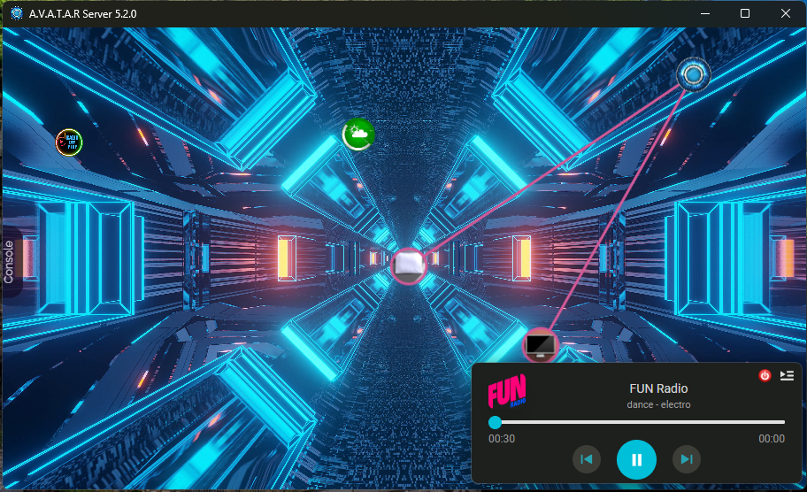

# Plugin WebRadio




### ✨ Fonctionnalité
Le plugin Webradio est un player radio pour le framework [A.V.A.T.A.R](https://github.com/Avatar-Home-Automation).
Il vous permettra d'écouter la radio de votre choix.

- 75 radios disponibles, vous pouvez augmenter le nombre dans la configuration du plugin. `player/nbradio`
- Vous pouvez également ajouter vos radios favorites dans `player/favoris`.
- Le player est multiroom (mets la radio dans la chambre/salon etc...)
- ✨ Rapide ✨

### ✨ Nouvelle Fonctionnalité
- Le Player est basé sur la librairie [Amplitudejs](https://521dimensions.com/open-source/amplitudejs) - ✨ Rapide ✨
- 

## Installation

webradio requires [Avatar Server](https://github.com/Avatar-Home-Automation) v5.0.0+ to run.

Installation.

```sh
 1. Trouvez ce plugin dans la bibliothèque de plugins A.V.A.T.A.R et cliquez sur `installer`.
```